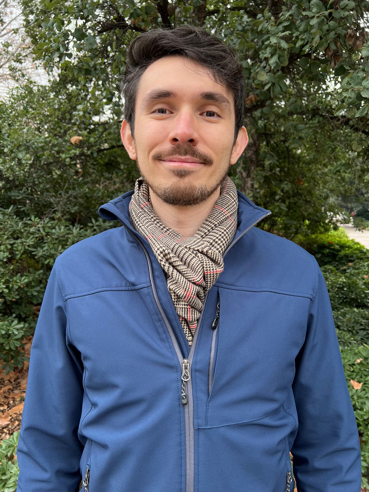

::::: {style="display: flex; align-items: flex-start; gap: 2rem; flex-wrap: wrap;"}
<!-- Foto y datos personales -->

::: {style="flex: 1; min-width: 280px; max-width: 350px; text-align: center;"}

### Sergio Huertas Hernández  
Ph.D. Candidate at the Pontificia Universidad Católica de Chile  
📍 Santiago, Chile  
📧 sahuertas@uc.cl  
🔗 [Google Scholar](https://scholar.google.es/citations?user=fv7N0eUAAAAJ&hl=es&oi=ao)  
🔗 [LinkedIn](https://www.linkedin.com/in/sergio-huertas-hern%C3%A1ndez/)  
🔗 [Twitter/X](https://x.com/SergioHuertasif)  
🔗 [ResearchGate](https://www.researchgate.net/profile/Sergio-Huertas-Hernandez?ev=hdr_xprf)  
🔗 [Bluesky](https://bsky.app/profile/sergiohuertas.bsky.social)

<!-- Presentación académica -->

## About me

Welcome! I am a Ph.D. Candidate in Political Science at the [**Pontificia Universidad Católica de Chile**](https://cienciapolitica.uc.cl/cuerpo-academico/jornada-parcial/huerta-sergio), an Adjunct Researcher at the [**Millennium Nucleus for the Study of Political Crises in Latin America (CRISPOL)**](https://crispol.cl/), and a Research Fellow at the [**Latin America Regional Center of the Varieties of Democracy Project (V-Dem)**](https://www.v-dem.net/about/regional-centers/latin-america/).

My research is driven by a fundamental question: **how can we assess the functioning of democracy through its institutions?** This question has led me to examine the incentives that shape the strategic behavior of political actors within complex and evolving institutional frameworks. I specialize in the analysis of political institutions, focusing on **executive-legislative relations**, **mechanisms of legislative oversight**, and **regime transformations** in Latin America. In particular, I investigate the **role of opposition forces**, **institutional checks and balances**, and the **structural conditions that enable—or undermine—democratic resilience**. My research agenda seeks not only to explain institutional design and performance, but also to uncover their broader political consequences.

Methodologically, I adopt a **multi-method approach** that blends quantitative rigor with qualitative depth. I draw on **game theory**, **Qualitative Comparative Analysis (QCA)**, **archival research**, and **natural language processing (NLP)** to analyze large corpora of political texts and explore legislative processes, institutional norms, and strategic interactions from multiple angles. This is complemented by the use of a broad array of statistical models, including **logit**, **OLS**, **multinomial logit**, **ordered logit**, and **survival analysis**. This toolkit allows me to combine analytical nuance in the comparative study of complex political phenomena.

My work has been published in journals such as *Political Research Quarterly*, *Journal of Legislative Studies*, *Journal of Ethnic and Migration Studies*, *PS: Political Science & Politics*, and *Revista de Ciencia Política*, among others. I have contributed to several **Democracy Reports** from the **V-Dem Institute** and participated in multiple research projects funded by **FONDECYT** through the Chilean National Research and Development Agency (**ANID**).

I was born and raised in **Colombia**, where I earned my **B.A. in Political Science** from **Universidad del Tolima**. I also hold two master’s degrees: one in **Comparative Politics** from **FLACSO-Ecuador**, and another in **Political Science** from the **Pontificia Universidad Católica de Chile**.

Feel free to explore this site to learn more about my **publications**, **current projects**, **teaching experience**, and how to **get in touch**.

